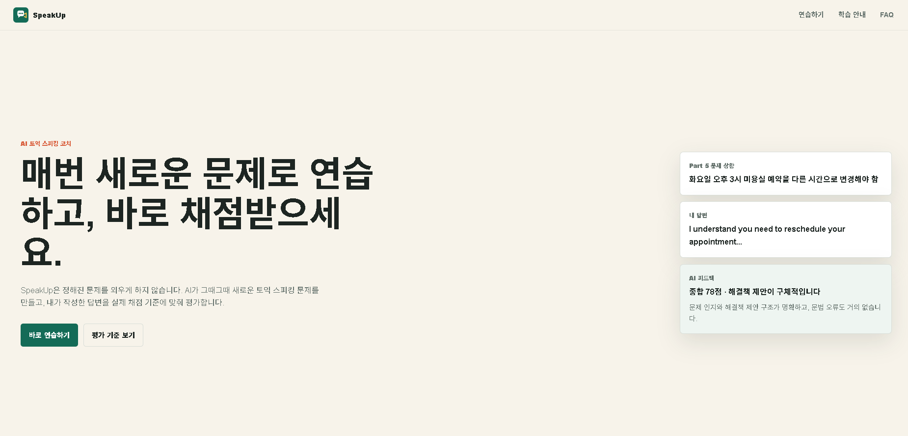
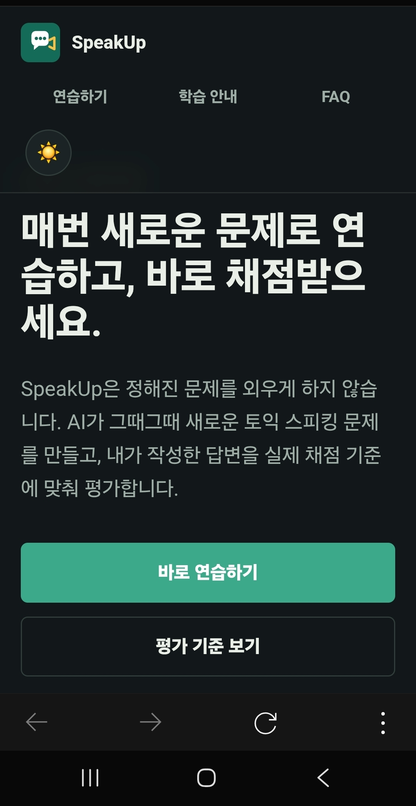
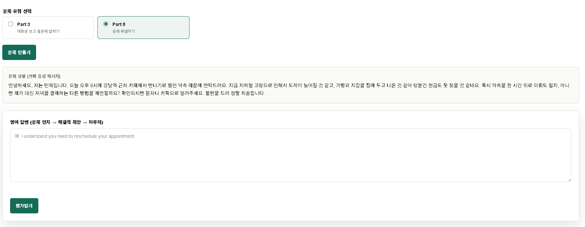
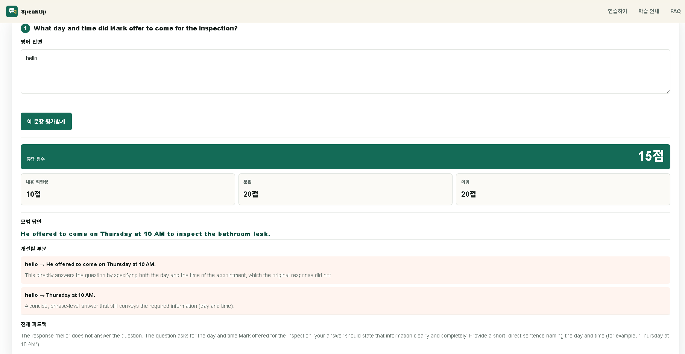
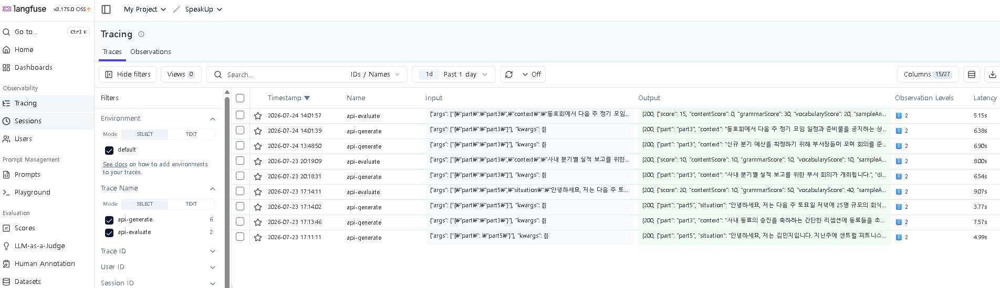
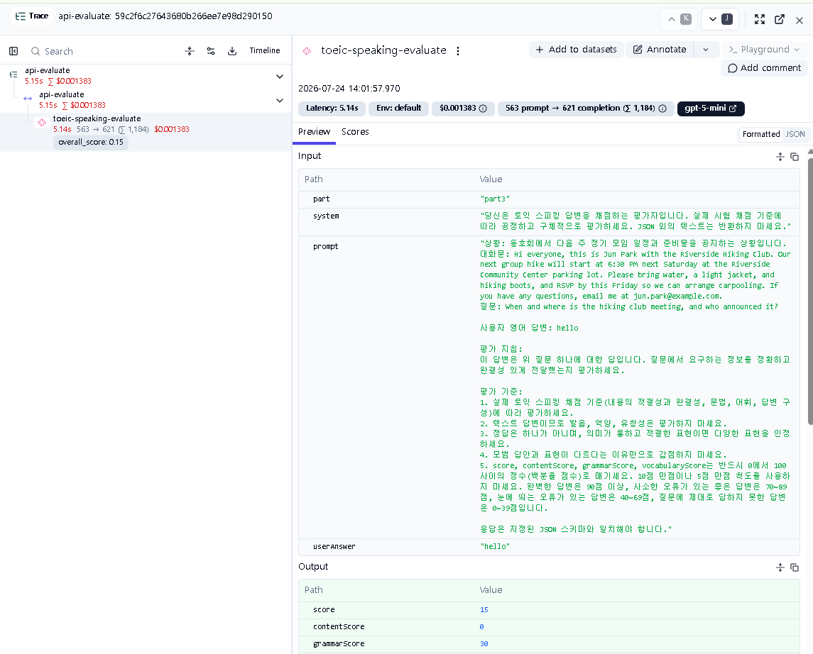

# SpeakUp

SpeakUp은 AI가 토익 스피킹(TOEIC Speaking) 문제를 그때그때 새로 생성하고, 사용자가 작성한 답변을 실제 채점 기준에 맞춰 평가해 주는 연습 웹 서비스입니다. 정해진 문제를 반복 학습하는 대신, 매번 새로운 상황으로 실전 감각을 기르는 것을 목표로 합니다.

- 배포 URL: https://vercel-project-three-weld.vercel.app
- GitHub 저장소: (본 저장소)

## 목차

- [서비스 소개](#서비스-소개)
- [페이지 및 섹션 구성](#페이지-및-섹션-구성)
- [핵심 기능](#핵심-기능)
- [AI 기능 상세](#ai-기능-상세)
- [기술 스택](#기술-스택)
- [프로젝트 구조](#프로젝트-구조)
- [실행 방법](#실행-방법)
- [환경 변수](#환경-변수)
- [배포 방법](#배포-방법)
- [다크 모드](#다크-모드)
- [스크린샷](#스크린샷)
- [AI 코딩 도구 사용 과정](#ai-코딩-도구-사용-과정)
- [서비스 기획서](#서비스-기획서)
- [보안 주의사항](#보안-주의사항)

## 서비스 소개

- **서비스 목적**: 토익 스피킹 시험을 준비하는 학습자가 정해진 문제은행이 아니라 매번 새로운 문제로 실전처럼 연습하고, 제출한 답변에 대해 실제 채점 기준에 가까운 구체적인 피드백을 받을 수 있게 합니다.
- **타겟 사용자**: 토익 스피킹을 준비하는 한국어 사용자, 특히 Part 3(대화문 기반 질의응답)와 Part 5(문제 해결하기) 유형을 반복 연습하고 싶은 학습자.
- **핵심 가치**
  - 문제를 외우지 않고 매번 새로운 상황으로 연습합니다.
  - 실제 토익 스피킹 채점 기준(내용 적절성, 문법, 어휘, 답변 구성)에 맞춰 평가합니다.
  - 점수뿐 아니라 모범 답안과 구체적인 개선 포인트를 함께 제공합니다.

자세한 기획 배경과 MVP 범위는 [서비스 기획서](#서비스-기획서) 섹션의 문서를 참고하세요.

## 페이지 및 섹션 구성

한 페이지 안에서 상단 내비게이션으로 이동하는 4개 섹션으로 구성됩니다.

| 섹션 | 경로 | 내용 |
| --- | --- | --- |
| 홈 (Hero) | `#home` | 서비스 소개, 시작하기 버튼 |
| 연습하기 | `#practice` | Part 3 / Part 5 선택, AI 문제 생성, 답변 입력 및 AI 평가 |
| 학습 안내 | `#guide` | 토익 스피킹 채점 기준(내용/문법·어휘/구성) 설명 |
| FAQ | `#faq` | 서비스 이용 관련 자주 묻는 질문 |

상단 헤더의 내비게이션(연습하기 / 학습 안내 / FAQ)으로 각 섹션을 바로 이동할 수 있습니다.

## 핵심 기능

- Part 3(대화문 보고 질문에 답하기) / Part 5(문제 해결하기) 유형 선택
- OpenAI API 기반 문제 자동 생성 (매 요청마다 새로운 상황·인물·소재)
- 텍스트로 답변을 작성하면 문항 단위로 즉시 AI 평가
- 종합 점수, 내용 적절성, 문법, 어휘 점수 표시
- 모범 답안, 개선할 부분, 전체 피드백 제공
- 빈 입력, 한글만 입력, API 오류, 응답 지연 상황에 대한 안내 메시지
- 모바일/데스크톱 반응형 UI
- 라이트/다크 모드 전환 (시스템 설정 자동 감지 + 토글 버튼, 선택 유지)
- Langfuse를 통한 AI 호출 관측(trace) — 문제 생성·평가 요청의 프롬프트, 응답, 토큰 사용량을 기록

## AI 기능 상세

과제 평가 기준의 "AI 기능 입력 → 처리 → 출력 → 실패 처리" 흐름을 두 개의 엔드포인트로 구현했습니다.

### 1) 문제 자동 생성 — `POST /api/generate`

- **입력**: 문제 유형(`part`: `part3` 또는 `part5`)
- **처리**: OpenAI에 유형별 프롬프트를 전달하고, 구조화된 JSON(`json_schema`) 형식으로 응답을 강제해 매번 새로운 상황을 생성합니다.
- **출력**
  - Part 3: 상황 설명, 대화문, 질문 3개
  - Part 5: 문제 상황(전화 음성 메시지 형태 텍스트), 핵심 문제 요약
- **실패 처리**
  - 지원하지 않는 유형 → 400과 함께 "지원하지 않는 문제 유형입니다."
  - OpenAI 호출 실패/응답 파싱 실패/타임아웃 → 500과 함께 "문제를 생성하지 못했습니다. 잠시 후 다시 시도해 주세요."

### 2) 답변 평가 — `POST /api/evaluate`

- **입력**: 문제 맥락(상황/대화문/질문 또는 상황/문제 요약) + 사용자가 작성한 영어 답변
- **처리**: OpenAI에 토익 스피킹 채점 기준(내용 적절성, 문법, 어휘, 답변 구성)을 명시한 프롬프트로 평가를 요청하고, 점수(0~100)와 모범 답안, 개선점을 구조화된 JSON으로 받습니다.
- **출력**: 종합 점수, 항목별 점수(내용/문법/어휘), 모범 답안, 개선할 부분 목록, 전체 피드백
- **실패 처리**
  - 빈 답변 → 400과 함께 "답변을 입력해 주세요."
  - 한글만 입력한 답변 → 400과 함께 "영어로 답변을 작성해 주세요."
  - OpenAI 호출 실패/타임아웃 → 500과 함께 "평가 중 오류가 발생했습니다. 잠시 후 다시 시도해 주세요."
  - 프론트엔드에서 30초 응답 지연 시 자체적으로 요청을 중단하고 "응답이 지연되고 있습니다. 잠시 후 다시 시도해 주세요." 안내

두 엔드포인트 모두 문항/평가 단위로 중복 제출을 막고(버튼 비활성화), 진행 상태를 로딩 메시지로 표시합니다. 상세 입출력 스펙은 [`docs/api-spec.md`](docs/api-spec.md)를 참고하세요.

### 프론트엔드 연동 (`js/app.js`)

프론트엔드는 `fetch`로 위 두 엔드포인트를 직접 호출하고, 응답 상태에 따라 화면을 갱신합니다.

- **요청**: `fetch("/api/generate", { method: "POST", ... })`, `fetch("/api/evaluate", { method: "POST", ... })` — `Content-Type: application/json` 헤더와 JSON 바디로 요청
- **정상 응답**: `response.ok`이면 JSON 바디를 파싱해 문제 카드(`renderPart3`/`renderPart5`) 또는 평가 결과 블록(`buildResultBlock`)을 렌더링
- **에러 응답**: `response.ok`가 아니면 서버가 내려준 `error` 메시지를 그대로 화면에 표시(별도 메시지 하드코딩 없이 서버 메시지 우선 사용)
- **타임아웃 처리**: `AbortController`로 30초 제한을 걸어 두고, 응답이 늦어지면 요청을 직접 중단하고 "응답이 지연되고 있습니다. 잠시 후 다시 시도해 주세요." 안내
- **중복 제출 방지**: 요청이 진행 중인 동안 버튼을 비활성화하고 로딩 문구("문제를 만들고 있습니다." / "답변을 평가하고 있습니다.")를 표시, 응답을 받으면(성공이든 실패든) 버튼을 다시 활성화

## 기술 스택

- Frontend: HTML, CSS, JavaScript (프레임워크 미사용)
- Backend: Vercel Serverless Functions, Python (FastAPI)
- AI API: OpenAI API
- 관측: Langfuse (self-hosted)
- Deploy: Vercel

## 프로젝트 구조

```text
index.html
css/
  styles.css
js/
  app.js
api/
  index.py          - FastAPI 앱, 라우팅 (/api/generate, /api/evaluate, 정적 파일 서빙)
  generate.py        - 문제 생성 로직 (요청 검증, OpenAI 호출, Langfuse 계측)
  evaluate.py         - 평가 로직 (요청 검증, OpenAI 호출, Langfuse 계측)
  observability.py    - Langfuse 클라이언트 초기화 및 flush 헬퍼
images/
docs/                 - 서비스 기획서 및 SDD 문서, 증빙 자료
requirements.txt
vercel.json
README.md
```

프론트엔드(`index.html`, `css/`, `js/`)와 백엔드(`api/`)가 폴더 단위로 분리되어 있습니다.

## 실행 방법

정적 화면만 확인하려면 다음 명령을 실행합니다.

```bash
python3 -m http.server 3000
```

브라우저에서 아래 주소를 엽니다.

```text
http://localhost:3000
```

Python API까지 로컬에서 확인하려면 Python 3.12 이상의 가상환경을 만들고 의존성을 설치한 뒤, 그 가상환경을 활성화한 상태로 Vercel CLI를 실행합니다. (가상환경이 없으면 시스템 기본 Python으로 실행되어 오류가 날 수 있습니다.)

```bash
python3.12 -m venv .venv
source .venv/bin/activate
pip install -r requirements.txt
vercel dev
```

## 환경 변수

API 키는 코드에 직접 넣지 않습니다. 로컬에서는 `.env.local`에 설정하고, Vercel 배포 환경에서는 Project Settings의 Environment Variables에 설정합니다.

```text
OPENAI_API_KEY=your_openai_api_key
OPENAI_MODEL=gpt-5-mini

LANGFUSE_PUBLIC_KEY=your_langfuse_public_key
LANGFUSE_SECRET_KEY=your_langfuse_secret_key
LANGFUSE_BASE_URL=your_langfuse_instance_url
```

| 변수 | 필수 여부 | 설명 |
| --- | --- | --- |
| `OPENAI_API_KEY` | 필수 | 문제 생성·평가에 사용하는 OpenAI API 키 |
| `OPENAI_MODEL` | 선택 | 미설정 시 기본 모델(`gpt-5-mini`) 사용 |
| `LANGFUSE_PUBLIC_KEY` | 선택 | Langfuse 관측을 사용할 때만 필요 |
| `LANGFUSE_SECRET_KEY` | 선택 | Langfuse 관측을 사용할 때만 필요 |
| `LANGFUSE_BASE_URL` | 선택 | self-hosted Langfuse 인스턴스 주소. Vercel(외부 클라우드)에서도 접근 가능한 공인 주소여야 함 |

Langfuse 환경 변수가 없으면 관측 없이 기존 기능만 정상 동작합니다(Fail-safe). 위 값은 예시이며 실제 키 값이 아닙니다.

## 배포 방법

1. GitHub 저장소에 코드를 push합니다.
2. Vercel에서 GitHub 저장소를 연결합니다.
3. Vercel Project Settings → Environment Variables에 `OPENAI_API_KEY`(필수), 필요 시 `LANGFUSE_PUBLIC_KEY` / `LANGFUSE_SECRET_KEY` / `LANGFUSE_BASE_URL`을 추가합니다.
4. Vercel 배포를 실행합니다(`vercel deploy --prod` 또는 GitHub 연동 자동 배포).
5. 배포 URL에서 메뉴 이동, 반응형 화면, 문제 생성/평가 AI 기능을 확인합니다.

## 다크 모드

헤더 우측의 토글 버튼(🌙/☀️)으로 라이트/다크 테마를 전환할 수 있습니다.

- 최초 접속 시 브라우저의 시스템 다크 모드 설정(`prefers-color-scheme`)을 자동으로 반영합니다.
- 토글 버튼으로 직접 전환하면 선택한 테마가 `localStorage`에 저장되어, 이후 재방문·새로고침 시에도 유지됩니다.
- 테마 적용은 `<head>`의 인라인 스크립트에서 페이지 렌더링 전에 처리되어 전환 시 화면 깜빡임(FOUC)이 없습니다.
- 색상은 `css/styles.css`의 CSS 커스텀 프로퍼티(`--bg`, `--surface`, `--ink` 등)로 관리되며, `:root[data-theme="dark"]`에서 다크 팔레트로 재정의됩니다.

## 스크린샷

| 구분 | 스크린샷 |
| --- | --- |
| 데스크톱 화면 |  |
| 모바일 화면 |  |
| AI 기능 동작 (문제 생성) |  |
| AI 기능 동작 (평가 결과) |  |

## AI 코딩 도구 사용 과정

- 대화 로그/스크린샷: [`docs/evidence/ai-coding-log.png`](docs/evidence/ai-coding-log.png) (또는 텍스트 로그 파일)


## 서비스 기획서

서비스 기획과 SDD(Spec-Driven Development) 문서는 `docs/` 폴더에 정리되어 있습니다.

- [`docs/service-plan.md`](docs/service-plan.md) — 서비스 기획서 요약(아이디어, 목적, 타겟 사용자, 섹션 구성, AI 기능 정의)
- [`docs/product-spec.md`](docs/product-spec.md) — 서비스 목적, 타겟 사용자, 핵심 가치, MVP 범위
- [`docs/user-flows.md`](docs/user-flows.md) — 사용자 흐름, 화면 전환, 실패 흐름
- [`docs/data-model.md`](docs/data-model.md) — 데이터 모델(문제 생성/평가 요청·응답 구조)
- [`docs/api-spec.md`](docs/api-spec.md) — API 입력/출력/에러 스펙, Langfuse 관측
- [`docs/implementation-plan.md`](docs/implementation-plan.md) — 구현 순서와 결정 사항
- [`docs/assignment-criteria.md`](docs/assignment-criteria.md) — 과제 제출 기준 체크리스트

## LLM 모니터링 / 로깅



